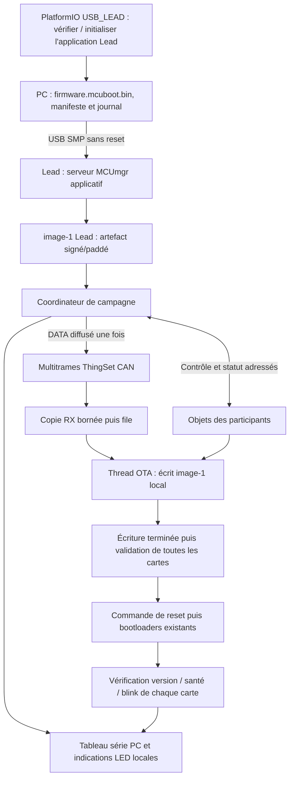

# Rapport d’implémentation — mise à jour collective ThingSet/CAN

Date : 23 septembre 2026. Core, branche `main`, HEAD
`8111a0dc798e9bd426081d5705af77a86cd7dbf8`.

Révision du plan : 24 septembre 2026, après clarification du parcours opérateur.

**Statut : audit des sources et plan de réalisation. La mise à jour collective
n’est pas implémentée ni validée sur matériel par ce rapport.**

## 1. Objectif et organisation des documents

L’objectif est de transférer une image depuis un ordinateur vers une carte Lead
par USB, puis de mettre à jour toutes les cartes sélectionnées sur son bus CAN
avec ThingSet. Les RJ45 sont supposés relier les cartes au même bus CAN : brochage,
terminaisons et limites de longueur restent à confirmer sur les schémas matériels.

Ce rapport est la référence pour les constats du dépôt, les modifications à
réaliser, leur ordre et leurs critères de réussite. Il complète :

- le [plan système](can_broadcast_ota_action_plan.md), pour l’architecture et les garanties ;
- le [plan SDK ThingSet](thingset_can_broadcast_ota_action_plan.md), pour le transport, le format des messages et les correctifs SDK.

Les fichiers, fonctions, commandes et options indiqués comme **proposés** sont
des travaux à réaliser ou à finaliser, pas des fonctionnalités livrées. Des
ébauches locales peuvent exister ; elles ne constituent pas une implémentation
validée. Cette révision modifie uniquement le rapport, sans reprendre les travaux
de code ni effectuer de flash.

### Décisions retenues pour le prototype

1. **Conserver les bootloaders installés.** Ne pas les reconstruire, les remplacer
   ni créer une nouvelle clé pour ce projet. Réutiliser la chaîne de génération
   et de signature existante ; vérifier ses paramètres et un firmware accepté
   par les cartes. Les informations manquantes sur le bootloader bornent les
   garanties de qualification, sans imposer son remplacement.
2. **Réutiliser `firmware.mcuboot.bin`, y compris son padding/trailer actuel.**
   On suppose qu’aucun reset ni aucune coupure d’alimentation imprévue ne survient
   entre le dépôt de l’image sur la Lead et la commande finale de redémarrage.
   La tâche n’envoie aucun reset pendant ce transfert. Une image complète peut
   déjà être activable au prochain boot : on ne revendique donc pas la protection
   contre une activation prématurée en cas de reset. L’artefact compact et
   l’armement différé deviennent une évolution optionnelle (§3.2).
3. **Créer l’environnement PlatformIO `USB_LEAD` et une Project Task unique**
   qui construit l’image, identifie la Lead par série, initialise son application
   si nécessaire, dépose l’image, puis orchestre la diffusion et le suivi final.
   L’installation initiale de l’application comporte un reset avant toute campagne.
4. **Préinstaller le service OTA dans l’application de chaque module.** À chaque
   démarrage il initialise CAN/ThingSet, répond à la découverte et attend les
   commandes. Une file bornée et un thread OTA traitent les données en arrière-plan.
   On réutilise le driver CAN Zephyr et le transport ThingSet : le nouveau composant
   est un service OTA, pas un nouveau driver matériel CAN.
5. **Prévoir une application de test `main` à clignotement versionné**, des motifs
   LED d’état OTA et un tableau de suivi série donnant les étapes et résultats
   de chaque carte, jusqu’à la vérification après redémarrage (§6).

Ces décisions priment pour ce prototype sur les passages des deux plans liés
qui imposent encore `firmware.ota.bin`, `xArm` ou une absence d’activation au reset
avant ARM. Leurs constats techniques sur le transport restent applicables.

### Périmètre de la première version

- PC → Lead : USB CDC/SMP avec MCUmgr dans l’application.
- Lead → cartes : ThingSet sur un seul bus CAN, une instance, route zéro.
- Une Lead, une campagne active, liste de cibles figée par identité stable.
- Même image compatible pour toutes les cartes, Lead comprise ; rôle choisi au fonctionnement et conservé séparément du binaire.
- Bootloader existant inchangé ; application OTA à installer initialement sur chaque carte. La tâche automatise cette installation sur la Lead ; les autres modules sont provisionnés individuellement.
- CAN classique pour le prototype ; CAN FD/BRS après qualification du bus complet.
- Écriture séquentielle, réparation par rediffusion d’un suffixe ; aucune reprise d’écriture partielle après reset en V1.
- Validation de toutes les images avant la commande finale de reset ; aucune exclusion silencieuse.
- Hypothèse de prototype : aucun reset/coupure imprévu pendant le transfert. Redémarrage demandé par la tâche après validation, avec détection des résultats partiels au retour. Aucune garantie d’atomicité de la flotte.

## 2. Méthode, versions et limites de l’audit

Sources inspectées : configuration PlatformIO/Zephyr, scripts de génération et
d’upload, devicetree SPIN/shields, communication, objets ThingSet, initialisation
matérielle, puissance, tâches, NVS et CI. Les sources installées exactes de
ThingSet, Zephyr et MCUboot ont également été lues.

Les caches servent uniquement à l’audit. Toute modification d’une dépendance doit
être versionnée dans un fork ou intégrée amont, puis épinglée ; ne pas développer
dans le cache PlatformIO.

| Élément | Référence observée | Portée de la preuve |
|---|---|---|
| Core | HEAD indiqué en tête, fichiers de travail inspectés | État local, pas uniquement HEAD |
| Plateforme | `ststm32@19.0.0`, [pio_extra.ini](../owntech/pio_extra.ini) | Version demandée et installée |
| Zephyr installé | fichier `VERSION` : 4.0.0 ; package `3.40000.0` | Ne pas déduire la version Zephyr du numéro du package |
| ThingSet SDK | `e57447bbeb7c165e14a273242e8495343c1c6f54` | [west.yml](../west.yml) et checkout local propre |
| ThingSet node C | `68c7544830df2ba23f67e31bad91e124377827a3` | Manifest et checkout local propre |
| MCUboot du manifest | `f74b77cf7808919837c0ed14c2ead3918c546349` | Dépendance de build ; ne prouve pas le bootloader présent sur les cartes |
| Bootloader distribué par le script | release OwnTech `v1.1.0` | Téléchargé séparément, sans reconstruction par ce manifest |
| Cible choisie | SPIN `1_2_0`, TWIST `1_4_2` | [platformio.ini](../platformio.ini) et CMake courant |
| Build local | `.pio/build/USB/zephyr/.config` | Configuration générée, CAN/ThingSet désactivés ; aucune validation OTA |

Chemin local de référence pour les dépendances :
`C:/Users/afarahhass/.platformio/packages/framework-zephyr`.
Les modules sont sous `_pio/thingset-zephyr-sdk`, `_pio/modules/thingset-node-c`
et `_pio/bootloader/mcuboot`. Les références de lignes correspondent à cet audit.

L’audit initial du 23 septembre ne comportait aucun flash, essai électrique,
benchmark ni build de firmware ; son build inspecté ne contenait que configuration
et devicetree. Depuis, un build de référence `USB`, isolé dans
`.pio/ota-baseline/USB`, a réussi et produit `firmware.mcuboot.bin` signé.
Le journal `.pio/ota-baseline.log` donne, au linker, 96 872 octets de FLASH et
31 616 octets de RAM utilisés. Cela vérifie la chaîne de build actuelle, pas
son acceptation sur les cartes ni la taille d’un firmware OTA complet. Cette
révision documentaire ne lance aucun nouveau build ni essai matériel.
Les modifications préexistantes de `.vscode/settings.json` et
`zephyr/CMakeLists.txt` sont conservées. Les deux plans initiaux étaient déjà
présents dans le dossier `Idea`, non suivi par Git au début de l’intervention.

## 3. Constats du dépôt lors de l’audit et conséquences pour le plan révisé

### 3.1. Carte des sources et conséquences

| Source, lignes au moment de l’audit | Constat | Travail nécessaire |
|---|---|---|
| [prj.conf](../zephyr/prj.conf), 69–77, 121 | MCUboot/image manager actifs ; CAN explicitement désactivé | Ajouter profils CAN/OTA ; le gestionnaire d’image seul n’est pas un serveur USB |
| [Communication Kconfig](../zephyr/modules/owntech_communication/zephyr/Kconfig), 17–27 | Sélection de CAN, ISO-TP, SDK et `THINGSET_CAN_ITEM_RX` | Ajouter réception multitrames et campagne ; distinguer item et report |
| [Communication CMake](../zephyr/modules/owntech_communication/zephyr/CMakeLists.txt), 18–23 | Compile l’adaptateur CAN existant | Intégrer un module OTA dédié |
| [thingset_can.c](../zephyr/modules/owntech_communication/zephyr/src/thingset_can.c), 38–94 | Un buffer global et un `k_work` pour les items `>=0x8000` | Pas une file de blocs ; filtrer strictement les commandes et séparer l’OTA |
| [CanCommunication.cpp](../zephyr/modules/owntech_communication/zephyr/src/CanCommunication.cpp), 86–110 | `stopSlaveDevice()` modifie un item ; setter d’adresse par simple affectation | Ni arrêt électrique garanti, ni gestion fiable de l’identité réseau |
| [data_objects.h](../zephyr/modules/owntech_communication/zephyr/src/data_objects.h), 31–51, 93–99 | IDs Device/Control existants ; firmware constant `1.0.0` | Publier vraie version/build/image, réserver les IDs OTA |
| [spin.dts](../zephyr/boards/owntech/spin/spin.dts), 31, 138–152 | `thingset,can=&fdcan2`, deux slots et NVS | Vérifier le contrôleur final par shield ; préserver partitionnement |
| [pre_bootloader_serial.py](../owntech/scripts/pre_bootloader_serial.py), 124–127, 179–188 | Passage à 1200 bauds puis reset après upload | Nouvelle cible de dépôt dans l’application sans reset |
| [pio_extra.ini](../owntech/pio_extra.ini), 24–35 | Header `0x200`, alignement 8, `secondary_slot=1` | Réutiliser l’image signée/paddée existante ; ajouter `USB_LEAD` et une tâche de campagne sans reset intermédiaire |
| [hardware_auto_configuration.cpp](../zephyr/modules/owntech_spin_api/zephyr/src/hardware_auto_configuration.cpp), 118, 144–163, 232 | Confirmation pendant init ; 1200 bauds déclenche le bootloader | Différer confirmation et garder l’endpoint OTA dans l’application |
| [src/main.cpp](../src/main.cpp) | Exemple de LED | Prévoir un exemple OTA de test avec fréquences A/B distinctes ; service OTA séparé du `main` |
| [CMake principal](../zephyr/CMakeLists.txt), 59–96 | Découvre modules locaux, `src/app.conf`, `src/app.overlay` | Point d’intégration naturel, sans concentrer l’OTA dans `main.cpp` |
| [CI PlatformIO](../.github/workflows/platformio.yml) | Build par défaut uniquement | Ajouter profils OTA, `USB_LEAD`, variantes blink A/B et tests protocolaires |

Les commandes SDK `DFU/xInit`, `DFU/xWrite`, `DFU/xBoot` existent dans la dépendance.
Le groupe `DFUCampaign`, le coordinateur, l’extension raw report proposée et le
serveur MCUmgr applicatif n’existent pas dans le Core inspecté.

### 3.2. Flash, image produite et bootloader installé

Offsets relatifs à la base flash `0x08000000` :

| Zone | Offset | Taille | Usage |
|---|---:|---:|---|
| Bootloader | `0x00000` | `0x10000` | MCUboot |
| `image-0` | `0x10000` | `0x37800` = 227 328 octets | Application active |
| `image-1` | `0x47800` | `0x37800` = 227 328 octets | Image candidate |
| Stockage | `0x7F000` | `0x1000` = 4 096 octets | NVS existant |

**La taille du slot n’est pas la taille maximale du programme ni du fichier OTA.**
Il faut réserver header, TLV/signature, alignement, trailer et espace requis par
l’algorithme de swap réellement installé.

Le générateur installé `scripts/platformio/platformio-build.py`, l. 1761–1762,
ajoute `--pad` quand `secondary_slot=1`. Le `pad_to()` d’imgtool écrit le magic
MCUboot en fin de slot (`scripts/imgtool/image.py`, l. 757–765). L’artefact actuel
`firmware.mcuboot.bin` peut donc être candidat au prochain boot avant même un
appel à `xArm`. **Le prototype accepte ce comportement sous l’hypothèse d’absence
de reset imprévu et réutilise ce fichier exact.** La production d’images MCUboot
est déjà assurée par la cible `mcuboot-image` de PlatformIO ; il faut ajouter
le manifeste, les vérifications et l’orchestration, pas une nouvelle chaîne de
signature. Ne pas tronquer le fichier signé ni modifier arbitrairement son trailer.

Évolution optionnelle hors du premier prototype : générer `firmware.ota.bin`
compact, depuis le même build et la même clé compatible, sans `--pad`, sans
`--confirm` et sans trailer d’activation. Cela permettrait un dépôt non armé,
puis un `xArm` explicite après validation. Cette variante n’est plus un préalable
à `USB_LEAD` et ne demande elle non plus aucune modification du bootloader.

La clé vide dans `.config` ne signifie pas « non signé » : le générateur installé
remplace une clé vide ou un chemin relatif introuvable par `root-rsa-2048.pem`, clé d’exemple publiée
(l. 498–514). Réutiliser pour le prototype la clé déjà résolue par la chaîne
existante, en consignant laquelle est utilisée ; aucune nouvelle clé n’est demandée.
La politique de clés d’une release reste à qualifier séparément avec le bootloader
installé. La version d’image prend sinon la valeur par défaut `0.0.0`
(l. 1778), distincte des versions board/shield.

Le hash de campagne est `SHA256(octets exacts de firmware.mcuboot.bin)`, header,
TLV, padding et trailer présents dans le fichier compris. Il est **distinct du
hash interne MCUboot**, notamment de celui affiché par les outils d’inventaire
d’image. Conserver les deux noms et domaines : `artifact_sha256` pour le transfert,
`mcuboot_image_hash` pour identifier l’image active après installation. Le
bootloader peut modifier les trailers au boot ; ne pas reconstituer le hash du
fichier paddé à partir d’un slot après swap comme preuve de l’image exécutée.

Exemple de capacité **conditionnel**, et non limite matériellement validée :
le DTS généré indique pages d’effacement 2048 et écriture 8 octets. Avec
`BOOT_MAX_IMG_SECTORS=128`, alignement 8, sans chiffrement, imgtool réserve un
trailer de `128*3*8 + 4*8 + 16 = 3120` octets. Sa borne de 224 208 octets ne suffit
pas à garantir le swap. Si le bootloader utilise swap-move avec ces paramètres,
la réserve arrondie occupe deux pages plus une page de déplacement :

```text
image complète maximale = 227328 - 4096 - 2048 = 221184 octets (0x36000)
```

Cette borne inclut header et TLV. La confirmer avec la configuration du bootloader
livré et le code `boot/bootutil/src/swap_move.c`, l. 237–256, 608–612.
`flash_img_init_id()` utilise la taille entière de la partition : il ne protège
pas automatiquement cet espace de swap. Distinguer dans le manifeste la taille
de l’image utile (header + programme + TLV), soumise à cette borne, et la taille
du fichier paddé à transférer, qui peut atteindre la taille du slot (`0x37800`).
PC, MCUmgr et récepteurs doivent partager ces deux limites. Ne pas comparer
aveuglément la longueur du fichier paddé à une capacité d’image compacte, ni
utiliser la taille du slot comme capacité maximale du programme. Seule la partie
padding/trailer conforme à l’artefact produit par la chaîne existante peut
occuper la zone réservée ; vérifier la structure avant dépôt.

Le [script d’installation](../owntech/scripts/pre_target_install_bootloader.py)
télécharge [OwnTech v1.1.0](https://github.com/owntech-foundation/bootloader/releases/tag/v1.1.0).
La [configuration source du tag](https://github.com/owntech-foundation/bootloader/blob/v1.1.0/boot/zephyr/prj.conf)
et son [Kconfig](https://github.com/owntech-foundation/bootloader/blob/v1.1.0/boot/zephyr/Kconfig)
prévoient une mise à jour avec retour possible et suggèrent swap-move. Ce ne sont
pas une `.config` du binaire installé ni une preuve de son identité sur les cartes.
Identifier, autant que possible, la provenance/configuration du binaire existant
et vérifier une image acceptée par les cartes permet de préciser les garanties
de taille, signature et retour arrière. Aucune étape de ce plan ne reconstruit
ni ne reflashe le bootloader ; `USB_LEAD` ne doit appeler aucune cible
`install_bootloader`. Une garantie non démontrée reste notée « non qualifiée ».

### 3.3. Défauts SDK à traiter avant la campagne

L’audit du commit épinglé est détaillé et sourcé dans le [plan SDK](thingset_can_broadcast_ota_action_plan.md).

1. Le client `thingset_can_send()` réinitialise la transaction dès la fin d’émission
   ISO-TP, même en succès (`src/can.c`, 555–562). Il faut conserver l’attente de la
   vraie réponse. Les tests amont utilisant directement `isotp_fast_send()` ne
   valident pas cette API publique.
2. Vérifier/corriger aussi durée de vie du buffer TX, libération du buffer partagé,
   erreurs TX/RX, callback terminal unique et messages reçus plus grands que le
   buffer réellement copié.
3. Le réassemblage multitrames ne réinitialise pas complètement longueur/séquence
   à un nouveau FIRST, manque de timeout et accède au contexte après libération
   (`src/can.c`, 218–253). Corriger avant de le qualifier pour l’OTA.
4. Le callback report provient du filtre CAN ; le buffer est libéré juste après.
   Copier en mémoire préallouée et traiter en thread, sans flash dans le callback.
5. Le pool de réception est global et indexé par source ; rester sur un seul bus.
   La découverte complète et une API publique propre de claims/sondes sont à ajouter.
6. Aucun champ `report_channel` indépendant n’est disponible dans l’ID CAN. Utiliser
   un préfixe de payload après réassemblage, sans détourner les bits de route.
7. Le sender FD positionne FDF mais pas BRS ; il complète la dernière trame avec
   des zéros. Débit accéléré et longueur logique ne se déduisent pas du seul DLC.
8. Le DFU legacy ignore le retour du flush dans `xBoot` et n’a pas d’exclusion avec
   MCUmgr. Préserver le service de maintenance seulement avec les garde-fous adaptés.

Ce sont des constats de lecture et défauts à reproduire par tests ciblés ; aucun
essai CAN n’a été réalisé pendant cet audit.

### 3.4. Matériel, sûreté, identité et persistance

SPIN choisit `fdcan2`. TWIST 1.4.x et Ownverter 1.0/1.1 l’activent ; TWIST 1.2/1.3,
Ownverter 0.9 et O2 1.1.2 activent `fdcan1` sans corriger ce `chosen` dans les
sources inspectées. Vérifier le DTS compilé pour chaque cible. TWIST 1.4.2 déclare
500 kbit/s nominal et 2 Mbit/s data ; cela ne qualifie pas les transceivers, BRS,
câbles RJ45 ou terminaisons. Le premier banc doit confirmer le CAN classique.

[Power.cpp](../zephyr/modules/owntech_shield_api/zephyr/src/Power.cpp), l. 338–371,
contient `shield.power.stop(ALL)`, qui coupe PWM et GPIO drivers des jambes connues.
Cette API retourne `void` et ne verrouille pas un futur `start()` (l. 296–335).
Il faut aussi inhiber les accès directs `spin.pwm` et les commandes réseau.

[TaskAPI.cpp](../zephyr/modules/owntech_task_api/zephyr/public_api/TaskAPI.cpp), l. 64–66,
fournit `stopCritical()`, mais [la tâche critique](../zephyr/modules/owntech_task_api/zephyr/src/uninterruptible_synchronous_task.cpp),
l. 107–122, appelle aussi `safety_task()`. L’arrêter peut supprimer la surveillance.
[disableSafetyApi](../zephyr/modules/owntech_safety_api/zephyr/src/safety_setting.cpp),
l. 348–350, désactive cette surveillance ; ce n’est pas une coupure de puissance.
Définir un hook de maintenance propre à l’application, vérifiable et maintenu
pendant les longues écritures flash, y compris sur la Lead avant l’upload USB.

Les objets matériels viennent essentiellement du shield compilé. Ajouter identité
SPIN/révision, shield/révision, layout, capacités bootloader/OTA et vraie version
logicielle. Les numéros de série/révisions disponibles dans
[MetaDataAPI.cpp](../zephyr/modules/owntech_spin_api/zephyr/src/MetaDataAPI.cpp), l. 55–152,
peuvent compléter l’inventaire, à condition d’être provisionnés.

Le [propriétaire NVS Core](../zephyr/modules/owntech_flash_driver/zephyr/public_api/nvs_storage.c),
l. 52–59, 133–162, utilise déjà deux secteurs dans les 4 Kio de stockage.
Les [catégories de clés](../zephyr/modules/owntech_flash_driver/zephyr/public_api/nvs_storage.h),
l. 54–60, servent à version, calibration, seuils et métadonnées. Réserver des clés
OTA auprès de ce propriétaire ; ne pas monter un second NVS/Settings sur la même
partition. Journaliser les transitions utiles, pas chaque bloc de firmware.

L’inhibition de maintenance doit être persistée et vérifiée avant le premier
effacement/écriture, puis restaurée avant toute autorisation de puissance ou
`setup_routine` au démarrage. Ce contrat s’applique à l’ancien firmware récepteur,
au nouveau firmware et à celui retrouvé après rollback. Un journal illisible ou
incohérent conduit à la maintenance par défaut ; il ne vaut pas autorisation de
reprise. Une absence valide de journal sur une carte normalement provisionnée
se distingue d’une erreur de lecture. Effacer le marqueur de maintenance demande
une transition explicite après vérification du résultat, pas une simple confirmation
MCUboot locale.

## 4. Architecture logicielle proposée



### 4.1. Fichiers à créer ou adapter

Les chemins de création sont proposés. Le préfixe `OTA/` désigne ici
`zephyr/modules/owntech_ota/zephyr/`.

| Emplacement proposé | Responsabilité |
|---|---|
| `OTA/Kconfig`, `OTA/CMakeLists.txt` | Options, dépendances et compilation |
| `OTA/public_api/OtaAPI.h` | Statut, démarrage, annulation et hooks applicatifs |
| `OTA/src/ota_coordinator.cpp` | Inventaire, liste figée, passes, timeouts, validation, autorisation du reset et suivi |
| `OTA/src/ota_participant.cpp` | Machine d’états et file ordonnée commandes/blocs |
| `OTA/src/ota_protocol.c` | Sérialisation bornée et vérification CRC |
| `OTA/src/ota_thingset.c` | Objets `DFUCampaign`, contrôle adressé et copie des reports |
| `OTA/src/ota_usb.c` | Groupe MCUmgr de campagne et garde de toutes les commandes image |
| `OTA/src/ota_storage.c` | Propriété/adoption/lecture du slot et journal via le NVS existant |
| `OTA/src/ota_safety.cpp` | Adaptation de la maintenance à l’application, puissance et tâches |
| `OTA/src/ota_health.cpp` | Santé après boot, identification de l’image et confirmation |
| `OTA/src/ota_feedback.cpp` | Arbitrage LED entre blink applicatif et motifs OTA ; événements de progression |
| `owntech/pio_extra.ini` | Nouvel environnement `USB_LEAD`, mêmes paramètres MCUboot, sans cible d’installation du bootloader |
| `owntech/scripts/pre_target_usb_lead.py` | Project Task `lead_update` : build, vérification/initialisation de l’application Lead puis campagne |
| `owntech/tools/ota_campaign.py` | Client PC : sélection USB, handshake, bootstrap applicatif, manifeste, découverte, dépôt, diffusion, reset, tableau série et journal |
| `examples/ota_blink/main.cpp` et profils associés | Exemple proposé A/B à fréquence/version distinctes, mêmes services OTA sur toutes les cartes |
| `tests/ota/` | Parseur, états, transport et stockage simulés, tests d’intégration |
| Fork ThingSet : cœur DFU et CAN | Extraction des primitives flash, corrections transport et API publiques |

`ota_storage.c` adapte le cœur DFU partagé ; il ne crée pas un second moteur
concurrent d’écriture flash. Le rôle Lead est une capacité du même binaire.
Si cela ne tient pas en mémoire, réviser explicitement cette hypothèse avant
une architecture à plusieurs images incompatibles.

La carte exécute le service depuis `image-0` pendant qu’elle remplit/lit
`image-1`. Écrire un nouveau programme dans `image-0` sans reset ne le met pas
en exécution. L’installation initiale utilise la procédure USB applicative
habituelle puis un redémarrage ; elle ne programme jamais la partition bootloader.
Un éventuel binaire d’amorçage de l’application Lead et l’image cible de campagne
ont des chemins explicites distincts dans la tâche pour éviter de diffuser le
mauvais fichier. Par défaut, le même binaire compatible embarque les deux rôles.
Si le bootstrap est identique à la cible, la Lead peut déjà exécuter la nouvelle
image avant la campagne. Cela ne prouve pas qu’une copie à diffuser est présente
dans `image-1` : imposer un dépôt explicite puis vérifier le contenu secondaire.
Tester ce cas avec MCUmgr ; s’il évite l’écriture d’une image déjà active, adapter
le dépôt applicatif via le même arbitre/writer pour obtenir cette copie, sans
réinitialiser ni redémarrer la Lead. Le premier banc A → B utilise A pour
l’initialisation, B pour la cible, afin d’observer aussi la bascule de la Lead.

### 4.2. Récepteur des modules et réutilisation du CAN existant

Installer une première fois sur **chaque** module une application contenant le
récepteur OTA, par USB ou ST-Link avec le bootloader conservé. La tâche de la Lead
ne peut pas ajouter à distance un récepteur CAN absent. Les images distribuées
ensuite doivent conserver les services nécessaires aux mises à jour suivantes.

Au démarrage, le module initialise le contrôleur CAN existant et ThingSet,
enregistre les callbacks puis reste disponible en arrière-plan :

```text
Driver CAN Zephyr → réassemblage ThingSet → copie dans une file bornée
                                           → thread OTA → image-1
```

- En attente : l’application fonctionne et le module répond à la découverte.
- Sur `xPrepare` adressé : vérifier campagne, Lead, taille et compatibilité,
  entrer en maintenance, préparer le slot, puis publier `READY`.
- Pendant la passe : seuls les DATA de cette campagne/source/passe sont acceptés.
  La réception physique d’un broadcast n’engage pas une carte non préparée.
- En fin de passe : drainer la file, fermer/valider le writer à la finalisation,
  puis publier le résultat. Le module attend l’autorisation finale de reset.

Callback/ISR : contrôler rapidement et copier, sans attente, effacement, hash
d’image ni écriture flash. Le thread dédié sérialise commandes et blocs ; la
réception réseau, les indications LED et la supervision restent réactives.
L’étage de puissance est maintenu dans l’état de maintenance pendant les écritures.
Le driver CAN matériel n’est pas à réécrire ; les correctifs nécessaires portent
sur le transport SDK et son intégration avec ce nouveau service.

### 4.3. Propriétaire unique du slot secondaire

Un arbitre doit couvrir MCUmgr, DFU legacy, participant CAN, lecture par la Lead,
effacement et activation. Un mutex local OTA ne protège pas automatiquement les
writers existants. Les entrées de chaque service doivent consulter le même état.

Pendant `USB_UPLOAD`, MCUmgr possède son writer. Après upload complet et fermeture,
le coordinateur adopte le slot **en lecture seule**. Il ne doit appeler ni un
`prepare()` qui efface, ni une réinitialisation du transfert. La Lead ne traite
pas sa propre diffusion comme une nouvelle réception.

Chaque follower possède un `flash_img_context` pendant la réception. `rOffset`
avance après un `append()` réussi dans le worker, jamais lors de la seule mise
en file. Il inclut les octets encore tamponnés dans `flash_img`. Il ne se déduit
pas uniquement de `flash_img_bytes_written()`, qui ne représente pas nécessairement
ces octets tamponnés. Avant flush, ce n’est pas un marqueur de reprise durable.

Dans les commandes et statuts de ce prototype, `image_size` désigne la taille
exacte du **fichier paddé transféré**, distincte de la taille du contenu image
mentionnée au §3.2. À `xFinalize`, après drainage et `rOffset == image_size`, effectuer l’unique flush
puis relire et hasher la flash sur la longueur logique exacte. Un retry retourne
le résultat mémorisé : Zephyr ferme le contexte lors du flush, donc ne pas le
flusher deux fois. Un échec flash est fatal pour la réception ; ne pas le
confondre avec une perte CAN réparable par simple rejeu.

Avant `stage_begin` ou `xPrepare`, vérifier aussi l’état MCUboot persistant :
l’image active doit être confirmée et le slot disponible pour un nouveau transfert.
Refuser les états test/non confirmé, pending, revert ou inconnus. Le slot secondaire
peut contenir la copie nécessaire au retour arrière précédent : un simple verrou
RAM ne suffit pas à autoriser son effacement après un reset. Réconcilier d’abord
journal, version active et état boot, puis revalider cette précondition sous le
verrou du slot.

Cette précondition porte sur **un nouveau transfert avant effacement**. L’image
paddée déposée par la campagne courante sur la Lead peut ensuite apparaître
pending : son adoption en lecture seule reste permise si propriétaire, campagne,
fichier et validation correspondent. Elle ne déclenche aucun nouvel effacement.
Un pending antérieur ou d’origine inconnue reste un motif de refus/réconciliation.

### 4.4. Contrôle, passes et idempotence

En V1, `xPrepare`, `xBeginPass`, `xEndPass`, `xFinalize`, `xAbort` et les
statuts utilisent des requêtes **adressées**. Les réponses sont collectées par
identité. Les commandes lentes copient leurs paramètres dans la file de travail
et répondent « accepté » ; le coordinateur attend ensuite `READY`, `VALID`, etc.

Les données volumineuses sont diffusées par l’enveloppe multitrames ThingSet,
avec un payload privé reconnu après réassemblage. Ce n’est pas un report standard
interprétable par tous les outils ThingSet. Le préfixe, les champs, l’ordre des
octets, le CRC et le padding sont spécifiés dans le plan SDK.

`xBeginPass` identifie la nouvelle passe et libère l’état « trou dans cette passe »
sans effacer. `xEndPass` est traité après les blocs déjà reçus. Le statut doit
distinguer file en cours, fin de passe traitée et offset accepté. Un polling trop
tôt ne doit pas transformer un backlog d’écriture en diagnostic de perte.

Répéter `xPrepare` identique ne doit pas effacer à nouveau ; répéter `xFinalize`
ne doit pas flusher un contexte déjà fermé. Le commit final autorise la commande
de reset après tous les `VALID` ; il n’est pas le premier instant où un fichier
paddé devient bootable. `xArm` est réservé à l’évolution compacte optionnelle.
Toute opération vérifie campagne, état et paramètres.
Les commandes d’une ancienne passe/campagne sont rejetées.

## 5. Implémentation pas à pas

Les étapes sont des lots de développement successifs. Les critères de sortie
ci-dessous sont à exécuter, et ne sont pas déjà satisfaits par cet audit.

### Étape 0 — Figer le socle et obtenir un build mesurable

**Fichiers :** `west.yml`, `owntech/pio_extra.ini`, profils de cible et futur
manifeste de release.

1. Archiver versions réelles, hashes des dépendances, outils et configuration.
   Le commentaire de `west.yml` cite `pre_west.py`, absent du Core : documenter le
   mécanisme réellement utilisé par le package PlatformIO pour le manifest.
2. Utiliser un build isolé et conserver les modifications de l’utilisateur.
3. Construire la référence actuelle puis une variante CAN/ThingSet minimale.
   Archiver `.config`, DTS final, ELF, map, taille flash et RAM.
4. Identifier le bootloader installé : hash, provenance, configuration, clé,
   algorithme de swap, trailer, capacité utile et recovery, à partir des éléments
   disponibles. Commencer par la chaîne actuelle et une image acceptée par une
   carte ; consigner les inconnues sans demander un remplacement du bootloader.
5. Vérifier `chosen thingset,can`, contrôleur actif et pins pour chaque shield ciblé.
6. Établir le banc initial : une Lead et deux followers compatibles, câblage et
   terminaisons confirmés, étage de puissance dans un état adapté au test.

**Sortie :** build reproductible, inventaire matériel/bootloader et budget mémoire.
Aucune marge, signature imposée ou capacité de rollback affirmée sans preuve.

### Étape 1 — Fiabiliser le transport SDK avant le coordinateur

**Fichiers SDK :** `src/can.c`, `include/thingset/can.h`, tests CAN ; adapter
`isotp_fast` seulement si la reproduction montre qu’il le faut.

1. Tester réellement `thingset_can_send()` : TX terminé, réponse retardée,
   timeout, réponse d’une mauvaise source, nouvelle transaction.
2. Séparer fin TX et fin de requête ; conserver l’attente de réponse après TX OK.
   Callback terminal exactement une fois, erreur TX/RX placée dans le bon champ.
3. Fixer ownership et durée de vie des buffers ; ne pas libérer un buffer partagé
   depuis une émission qui n’en est pas propriétaire.
4. Refuser les messages RX plus longs que le buffer disponible avant callback/parser.
5. Réinitialiser intégralement le réassemblage sur FIRST ; expirer les messages
   incomplets, libérer sur erreur et supprimer les accès après libération.
6. Propager erreurs immédiates/asynchrones du sender de reports ; traiter les
   callbacks tardifs après timeout sans compromettre l’émission suivante.
7. Ajouter tests de saturation, padding, compteurs et conservation des APIs legacy.
8. Versionner les corrections dans le fork et épingler son commit dans Core.

**Sortie :** aller-retour client fiable et réassemblage récupérable après perte,
sans dépendre encore d’une image firmware.

### Étape 2 — Réutiliser et identifier l’image MCUboot existante

**Fichiers :** cible `mcuboot-image` existante, script de manifeste, configuration PlatformIO,
version/build générés et client PC.

1. Construire `firmware.mcuboot.bin` avec les paramètres et la clé déjà utilisés.
   Conserver le format paddé et identifier explicitement la version/build de test.
2. Produire le manifeste : type d’artefact `mcuboot-padded`, taille du fichier,
   taille du contenu image, `artifact_sha256`, hash interne MCUboot attendu,
   version, build ID, compatibilité SPIN/shield/layout et protocole OTA.
3. Vérifier séparément la borne du contenu image et celle du fichier transféré
   (§3.2), avant toute écriture. Comparer aussi la capacité annoncée par les cartes.
4. Vérifier header, TLV, padding et trailer conformément à la chaîne existante ;
   tester bornes, fichier tronqué et format incorrect. Ne pas exiger l’absence
   de marqueur d’activation pour cet artefact.
5. Remplacer la version ThingSet constante par des métadonnées du build effectif.
6. Enregistrer dans le manifeste le hash de l’image cible effectivement diffusée,
   distinct de celui d’un éventuel binaire d’initialisation de la Lead. Conserver
   les cibles de recovery existantes en dehors de la tâche automatique.

**Sortie :** image signée/paddée issue de la chaîne existante, inspectable et
identifiée ; manifeste sans confusion entre hash de transfert et hash MCUboot.

### Étape 3 — Stockage partagé et état de maintenance

**Fichiers :** cœur DFU du fork, `ota_storage`, `ota_participant`, `ota_safety`,
intégration PowerAPI/TaskAPI et NVS.

1. Extraire prepare/append/finalize/validate/reboot/abort du DFU legacy.
   Vérifier le retour du flush, actuellement ignoré par `xBoot`.
2. Ajouter campagne, longueur, hash, offset attendu, état, erreur et propriétaire.
3. Vérifier l’image active confirmée et l’état boot compatible avant d’autoriser
   tout effacement du slot secondaire. Borner offsets, additions, longueurs et zone
   utilisable, y compris les règles du fichier paddé et la copie de retour arrière.
4. Implémenter l’arbitre commun de slot et l’adoption d’une image MCUmgr déjà écrite.
5. Définir `enter_maintenance()` avec résultat contrôlable et preuve de l’état sûr :
   inhibition des starts, transition électrique applicative, arrêt des sorties,
   traitement des commandes déjà en attente et supervision adaptée.
6. Tester l’arrêt/adaptation des tâches pouvant relancer la puissance, sans perdre
   silencieusement la surveillance en arrêtant la tâche critique.
7. L’abandon ferme les ressources et interdit le reset automatique de la tâche.
   Avec un fichier paddé, il ne garantit pas que le slot est désarmé. Conserver
   maintenance et diagnostics ; réconcilier le contenu et l’état boot avant
   toute nouvelle campagne ou décision de redémarrage.
8. Persister rôle, inhibition de maintenance et transitions utiles via le NVS
   existant. Vérifier la persistance avant le premier effacement ; restaurer cette
   inhibition avant les autorisations de puissance au boot, y compris après rollback.

**Sortie :** dépôt/validation locaux sans reset volontaire et exclusion de tous les
writers concurrents ; maintenance vérifiable sur la configuration de test.

### Étape 4 — `USB_LEAD` : vérification, initialisation et dépôt USB

**Fichiers :** `owntech/pio_extra.ini`, `pre_target_usb_lead.py`, client PC,
`ota_usb.c` et profils USB/overlay. Le parcours complet de la tâche est en §6.

1. Créer `USB_LEAD` avec la Project Task proposée `lead_update` (« Initialiser la
   Lead et diffuser »), utilisant la génération d’image existante. Distinguer
   dans l’orchestrateur initialisation applicative et dépôt de campagne.
2. Implémenter le handshake série `info` : signature de service, protocole,
   identité stable, version/build, rôle/capacités, état boot et taille des slots.
   Vérifier la disponibilité avant toute écriture ; un port occupé, une identité
   ambiguë ou un protocole incompatible ne justifie pas un flash aveugle.
3. Si l’application réceptrice est absente ou nécessite une initialisation,
   installer **l’application seulement** via le mécanisme USB existant. Le passage
   à 1200 bauds et le reset d’installation sont autorisés dans cette branche,
   avant dépôt de l’image cible. Retrouver la même carte après réénumération et
   attendre un handshake valide, la santé locale, la confirmation de l’image
   active et un slot secondaire disponible, avec timeout et tentatives bornés.
   Si le service est déjà compatible, sauter cette branche et son reset.
4. Activer MCUmgr image et son transport dans l’application de la Lead.
5. Résoudre la coexistence avec la console : préférer un CDC dédié si les endpoints
   le permettent, sinon un partage explicitement compatible et testé. Deux lecteurs
   UART concurrents ne peuvent pas simplement recevoir le même flux.
6. Définir `zephyr,uart-mcumgr` sur le périphérique choisi ; pendant le dépôt et
   la diffusion, ne pas ouvrir à 1200 bauds ni appliquer les hooks de reset du
   target USB existant. L’image à diffuser est écrite dans `image-1`, alors que
   le service en cours s’exécute dans `image-0`.
7. Ajouter une commande préalable vérifiant état MCUboot, maintenance persistée
   et propriété du slot, puis autoriser l’upload. La Lead doit être sûre avant
   le premier effacement USB ; préserver toute copie nécessaire au rollback.
8. Utiliser `MCUMGR_GRP_IMG_UPLOAD_CHECK_HOOK` pour autoriser/refuser ; les status
   hooks seuls sont des notifications et ne protègent pas le slot.
9. Couvrir également erase, image test/confirm, reset et DFU legacy. Si les hooks
   existants ne permettent pas de rejeter une commande, adapter son dispatch ou
   ne pas l’exposer sur l’endpoint de campagne.
10. À la fin, attendre fermeture du writer, vérifier longueur et hash de **tous
    les octets du fichier paddé**, puis adopter le slot en lecture seule et publier
    `STAGED`. Vérifier que MCUmgr a conservé l’artefact entier et n’a pas modifié
    le trailer à transmettre. Refuser tout nouveau dépôt pendant distribution.

**Sortie :** Lead identifiée et initialisée si nécessaire ; image cible exacte
déposée et lisible, sans reset entre ce dépôt et la fin de la campagne. Aucune
promesse n’est faite sur un reset imprévu avec l’artefact paddé.

### Étape 5 — Découverte, identité et préparation des cibles

**Fichiers :** API publique claims/sondes SDK, `ota_thingset`, coordinateur,
objets de capacité et persistance du rôle.

1. Exposer proprement les claims EUI/adresse et une interrogation bornée du bus.
   Les cartes déjà allumées ne réémettent pas nécessairement un claim spontanément.
   Les followers ont été provisionnés une première fois avec le récepteur (§4.2).
2. Lire identité, matériel, vraie version, protocole, capacité et état boot.
   Rejeter doublons, identité ambiguë, matériel incompatible et capacité insuffisante.
3. La tâche vise par défaut tous les modules OTA du banc et la Lead ; afficher
   l’inventaire et figer ces cibles par identité stable avec adresse courante.
   Comparer à une liste/nombre attendus configurés sur le banc : une découverte
   seule ne permet pas de détecter une carte muette jamais observée. Une carte
   attendue absente ou incompatible bloque le départ, sans exclusion silencieuse.
   Revalider le couple identité/adresse lors de PREPARE et après reboot.
   Interdire le setter direct d’adresse en campagne.
4. Envoyer `xPrepare` individuellement avec manifeste, Lead attendue et paramètres.
   La sélection n’est pas déduite de la seule réception physique d’un broadcast.
5. Répéter une préparation identique sans réeffacement ; refuser une campagne
   concurrente ou des métadonnées différentes pour le même identifiant.
6. Attendre tous les `READY` effectifs. Une exclusion exige une nouvelle sélection
   explicite avant de commencer, jamais une réduction silencieuse pendant transfert.

**Sortie :** au moins deux followers préparables et interrogeables,
avec association identité/adresse stable et erreurs compréhensibles.

### Étape 6 — Diffusion multitrames et réception à mémoire bornée

**Fichiers :** sender commun SDK, `ota_protocol`, dispatcher RX et file participant.

1. Réutiliser le type CAN `0x1` ; distinguer le payload OTA après réassemblage,
   sans réaffecter des bits CAN ni inventer `report_channel`.
2. Implémenter le codec du plan SDK ; premier choix proposé : 256 octets utiles,
   header de 32 octets, buffer de report de 512 octets.
3. Sérialiser les messages complets de la même source, y compris les reports
   ordinaires : aucun entrelacement et aucun écrasement du buffer TX.
4. Dans le callback CAN, vérifier rapidement taille/préfixe, copier dans un pool
   préalloué puis mettre en file avec `K_NO_WAIT`. Ne pas conserver le pointeur SDK.
5. File pleine : comptabiliser la perte sans avancer `rOffset`. En thread,
   vérifier CRC, identité, campagne, passe, état, offset et bornes avant append.
6. Traiter le padding DLC final selon le format explicite ; CRC seulement sur
   header utile et données utiles, pas sur une structure C ou le padding CAN.
7. Tester données synthétiques et pertes aux wraps séquence/message avant firmware.

**Sortie :** même bloc reconstitué par plusieurs cartes, sans réponse applicative
par bloc et sans allocation incontrôlée dans le chemin de réception.

### Étape 7 — Diffuser l’image et réparer les pertes

**Fichiers :** coordinateur, participant, image store, outil PC.

1. Envoyer `xBeginPass(campaign, pass_id, start_offset)` et attendre les états prêts
   pour cette passe. Réinitialiser l’état de trou, sans effacer ni perdre les octets
   contigus déjà acceptés.
2. Lire le slot secondaire de la Lead par fenêtres RAM bornées et diffuser les blocs.
   Régler les pauses pour le récepteur le plus lent, pas seulement pour le débit CAN.
3. Accepter `offset == rOffset`, ignorer les doublons entièrement reçus, rejeter
   recouvrements partiels et offsets hors image. Un offset supérieur crée un trou ;
   les données suivantes de cette passe ne sont pas écrites.
4. Attendre la fin réelle des émissions, puis `xEndPass`. La fin de passe côté
   participant doit être traitée après les blocs déjà mis en file.
5. Lire passe courante, fin de passe traitée, file drainée, `rOffset` et erreur.
6. Calculer `repair_offset = min(rOffset des participants incomplets)` et lancer
   une nouvelle passe depuis ce point. Les cartes plus avancées ignorent les doublons.
7. Borner nombre de passes, durée totale et absence de progrès. Ajuster le rythme
   si les compteurs montrent de la saturation, sans boucler indéfiniment.
8. Erreur flash : échec de campagne sans reset automatique, diagnostic visible.
   Un reset participant sort de l’hypothèse du prototype : arrêter la campagne,
   réconcilier les cartes avant toute nouvelle préparation. V1 ne reprend pas
   une écriture partielle après perte de RAM.

**Sortie :** une passe sur bus sans perte ; perte injectée réparée par suffixe ;
panne persistante terminée avec erreur précise. L’ACK physique CAN ne prouve pas
que toutes les cartes ont accepté et stocké le bloc.

### Étape 8 — Finaliser et valider toutes les images

**Fichiers :** image store, participant, coordinateur.

1. Envoyer `xFinalize` après traitement de la fin de passe et réception complète.
2. Flusher une seule fois, fermer le writer et vérifier taille/hash par lecture
   de la flash sur `[0, image_size)`.
3. Inclure dans le hash padding et trailer appartenant au fichier transmis.
   Exclure uniquement les octets ajoutés par le writer **au-delà** de `image_size`.
4. Vérifier header, bornes des TLV et compatibilité. La validation de transfert
   ne remplace pas la validation de signature par MCUboot au prochain boot.
5. Valider la Lead avec le même contrat, en lecture seule du slot déjà déposé.
6. Collecter `VALID` pour chaque identité. Toute erreur interdit le reset collectif
   volontaire et apparaît dans le tableau série. Distinguer `FLASH_COMPLETE`
   (writer fermé) de `VALIDATED` (relecture/hash/structure corrects).

**Sortie :** toutes les images valides, tous les programmes précédents encore en
fonctionnement. Hash erroné, fichier tronqué et taille excessive interdisent la
commande finale de reset ; le trailer déjà déposé ne constitue pas une validation.

### Étape 9 — Autoriser puis coordonner le redémarrage

**Fichiers :** coordinateur, participant, journal local/PC et API MCUboot côté
application. Aucun changement au programme du bootloader.

1. Conserver côté PC manifeste, liste figée et résultats avant le reset ; persister
   les transitions locales nécessaires à la réconciliation.
2. Attendre `VALID` et un état d’installation attendu pour **toutes** les cibles.
   Le fichier paddé contient déjà le marqueur utilisé par la chaîne existante :
   la tâche ne repose pas sur un `xArm` séparé pour rendre l’image candidate.
   Ne pas annoncer un transfert non armé avant cette barrière.
3. Le `commit` de la tâche autorise alors le reset. Il peut être automatique après
   cette barrière pour réaliser le parcours en une Project Task. Publier d’abord
   `ALL_VALIDATED`, puis `REBOOTING`, avec l’identifiant du commit.
4. Diffuser une commande de reboot campagne/commit/délai ; l’accepter seulement
   pour l’image validée de la campagne attendue. Les répétitions sont idempotentes :
   le premier timer posé n’est pas repoussé.
5. La Lead attend la fin d’émission puis programme son reboot. Un délai commun
   fournit une coordination approximative, pas une synchronisation d’horloge.
6. Distinguer absence de réponse et échec certain ; après le retour, réconcilier
   les identités et images avant tout nouvel effacement. Une erreur ou un `abort`
   ne retire pas automatiquement le marqueur d’installation déjà écrit.

**Sortie :** aucun reset volontaire de campagne avant validation de toutes les
images ; redémarrage coordonné au nominal et résultats partiels visibles au retour.
Un reset imprévu après dépôt du trailer peut activer une carte avant ses voisines.
Le terme « tout ou rien » ne doit pas être utilisé comme garantie atomique.

Pour l’évolution compacte seulement, insérer avant cette autorisation un
`xArm` adressé, idempotent, vérifiant le retour de
`boot_request_upgrade(BOOT_UPGRADE_TEST)`. Cette évolution reste distincte du
prototype à image paddée.

### Étape 10 — Vérifier le retour et confirmer après santé

**Fichiers :** `hardware_auto_configuration.cpp`, `ota_health`, objets de version,
restauration du rôle Lead et outil PC.

1. Conditionner la confirmation précoce existante pour une image en test ;
   conserver un parcours défini pour les installations ordinaires.
2. Démarrer en maintenance, vérifier initialisation, mémoire, périphériques et
   services requis, avec délai borné et supervision/watchdog adaptés.
3. Confirmer l’image locale seulement après réussite des autotests.
   Une image confirmée n’est pas supposée redevenir « test » à distance.
4. Si santé en échec, déclencher un reset maîtrisé/watchdog pour permettre le
   retour par le bootloader lorsqu’il est configuré. L’absence de confirmation
   ne redémarre pas spontanément le microcontrôleur.
5. Reconstituer l’inventaire par identité ; comparer hash interne MCUboot/build/version réels,
   santé, confirmation et éventuel retour arrière à la liste initiale.
   Vérifier aussi la fréquence blink annoncée par l’application de test. Le
   clignotement est un repère visuel, complété par l’identification logicielle.
6. Déclarer succès seulement si toutes les cibles sont revenues comme attendu.
   La remise en puissance nécessite une décision applicative explicite après
   vérification du groupe ; une flotte partielle ne passe pas pour un succès.

**Sortie :** succès par identité et image, affiché uniquement après retour de
toutes les cibles. Le retour individuel en panne de santé dépend des capacités
du bootloader existant et doit être qualifié avant d’être annoncé. Le rollback
collectif synchronisé reste hors V1.

### Étape 11 — Qualifier et automatiser

**Fichiers :** tests Core/SDK, CI, client PC et documentation d’exploitation.

1. Tests hôtes du codec et des états, simulation de stockage/transport, puis
   tests SDK sur CAN et scénarios matériels. Les tests critiques ne doivent pas
   tous dépendre d’un banc manuel.
2. Matrice de build : référence sans OTA, participant, `USB_LEAD`, exemple blink
   A à 1 Hz et B à 2 Hz, CAN classique, puis FD après validation. Vérifier la
   présence de `lead_update` dans Project Tasks et son parcours avec/sans bootstrap.
3. Mesurer flash/RAM, piles, pools, table des cibles, temps erase/write/hash,
   charge CAN et durée totale. Fixer limites à partir de ces mesures.
4. Tester une Lead + deux followers : A → B, puis une seconde campagne sans
   réinitialisation de la Lead, pour vérifier que le service OTA subsiste.
   Vérifier motifs LED, étapes du tableau série, hash/build/version et fréquence
   après reboot. Injecter pertes, file pleine et erreurs de validation, sans
   reset imprévu pour le premier prototype ; aucune erreur ne doit provoquer
   un reset automatique de récupération pendant le transfert.
5. Versionner le fork et documenter configuration, matériel supporté, clés,
   procédure recovery applicative USB/ST-Link et signification des erreurs opérateur.
6. Pour une qualification ultérieure, étendre à la taille/longueur maximales du
   réseau, aux bus-off et aux resets/coupures dans chaque phase. Ces essais sont
   hors de l’hypothèse du premier prototype ; évaluer alors la variante compacte
   et l’armement différé. Ne pas attribuer leurs garanties à l’image paddée actuelle.

**Sortie :** prototype reproductible et observé de bout en bout, avec défauts de
transfert traités ; limites et qualifications restant à réaliser clairement publiées.

## 6. Configuration, ressources et interface PC

### Environnement `USB_LEAD` et Project Task

Noms proposés à implémenter : environnement **`USB_LEAD`**, tâche **`lead_update`**,
libellé **« Initialiser la Lead et diffuser »**. Accès prévu dans VS Code :
`PlatformIO → Project Tasks → USB_LEAD → OTA → Initialiser la Lead et diffuser`.
Équivalent CLI prévu : `pio run -e USB_LEAD -t lead_update`. Ces entrées ne sont
pas déclarées comme déjà disponibles par ce rapport.

L’environnement conserve les paramètres de signature, header, alignement et
slots existants. Il compile le service OTA nécessaire au rôle Lead et au rôle
participant, avec sélection/persistance du rôle au fonctionnement. Les
environnements `USB` et `STLink` restent utilisables pour le provisionnement
applicatif individuel. Ne pas chaîner le target `upload` actuel pendant le dépôt
de campagne : ses hooks de 1200 bauds/reset sont réservés à l’initialisation.

| Phase de la tâche | Action et condition de passage |
|---|---|
| `BUILD` | Construire l’image cible avec `mcuboot-image`, vérifier sa structure et générer son manifeste/version/hash |
| `PROBE_LEAD` | Sélectionner la carte USB par identité/port explicites et lire `info` ; un service compatible évite le bootstrap |
| `INIT_LEAD` si nécessaire | Installer seulement l’application avec le service OTA via le bootloader existant, reset initial, retrouver la même identité ; attendre `info` compatible, santé, confirmation et slot disponible |
| `SELECT_ROLE` | Confirmer/configurer la carte USB sélectionnée comme Lead, persister son rôle hors du binaire et refuser une campagne concurrente |
| `DISCOVER` | Recenser tous les modules attendus, vérifier récepteur/compatibilité, figer la liste et la journaliser ; aucune carte incompatible ou manquante n’est retirée silencieusement |
| `USB_STAGE` | Entrer en maintenance, déposer l’image cible entière dans `image-1` de la Lead, fermer/vérifier le writer ; aucun reset |
| `PREPARE` puis `CAN_TRANSFER` | Préparer les followers, attendre tous les `READY`, diffuser et réparer les pertes de manière bornée |
| `VERIFY` | Attendre fermeture des writers et tous les `VALIDATED` ; afficher les résultats individuels |
| `COMMIT` puis `REBOOTING` | Autoriser automatiquement le reset si toutes les validations sont bonnes ; envoyer les commandes puis redémarrer la Lead |
| `RECONNECT` puis `POSTBOOT_CHECK` | Retrouver la Lead et chaque module de la liste initiale ; comparer identité d’image/build/version, santé et confirmation |
| `SUCCESS` ou `FAILED/PARTIAL` | Succès seulement si toutes les cartes exécutent l’image attendue ; conserver le journal et retourner un code d’échec sinon |

`info` vérifie une signature de service et une version de protocole explicites,
pas seulement la présence d’un texte quelconque sur le port série. Il distingue
la version du service OTA de la version de l’application à diffuser : une Lead
avec un service compatible n’est pas réinitialisée à chaque changement d’image.
Le bootstrap n’écrase ni le `main` utilisateur sur le PC ni le bootloader de la
carte. Le mécanisme doit pouvoir retrouver les ports console/MCUmgr de la même
carte après réénumération, sans confondre deux interfaces avec deux cartes.

Si plusieurs cartes USB sont présentes, une identité/option de port est requise
pour sélectionner la Lead. Un port occupé, un service busy ou une réponse ambiguë
produit un diagnostic ; l’absence de réponse seule ne prouve pas l’absence du
service et ne doit pas entraîner des réinstallations répétées. L’initialisation
ne commence qu’après sélection certaine de la carte et identification de son
état applicatif/bootloader par la procédure existante. Les délais de chaque
phase et le nombre d’essais sont bornés. Une erreur interrompt la tâche sans
reset de campagne automatique ni modification du bootloader.

### `main` de test et vérification du programme sur toutes les cartes

Prévoir un exemple séparé, par exemple `examples/ota_blink/main.cpp`, sélectionné
par un profil de test sans remplacer silencieusement `src/main.cpp`. Le service
OTA reste dans son module, initialisé au démarrage ; le `main` configure le blink
et publie l’identité de la variante. Le banc de test garde la puissance inhibée.

| Image de test | Fréquence de la LED au repos | Temporisation entre deux `toggle()` | Identité publiée proposée |
|---|---:|---:|---|
| A, initiale | 1 Hz, rapport cyclique 50 % | 500 ms | Version/build A et `blink_hz=1` |
| B, à diffuser | 2 Hz, rapport cyclique 50 % | 250 ms | Version/build B et `blink_hz=2` |

La fréquence désigne un **cycle complet allumé/éteint**. Un toggle toutes les
1 000 ms, comme dans l’exemple courant, donne un cycle de 2 secondes, soit 0,5 Hz.
Les valeurs 1 Hz et 2 Hz sont des choix de test modifiables, pas des contraintes
du protocole. Employer une tâche/timer non bloquant pour les autres services.

Procédure de banc :

1. Installer A avec le récepteur sur une Lead et au moins deux followers, en
   conservant leurs bootloaders. Vérifier identités, versions et blink à 1 Hz.
2. Construire B puis lancer `USB_LEAD / lead_update`. Pendant la campagne,
   les motifs OTA prennent temporairement la priorité sur le blink ; la version
   logicielle exécutée reste A jusqu’au reset final demandé.
3. Observer les phases d’effacement, écriture, validation et redémarrage sur les
   LED et dans l’écran série. La tâche attend toutes les cartes.
4. Après reboot et contrôle de santé, constater sur **chaque** carte le blink à
   2 Hz, le build B et l’identité d’image attendue. Vérifier le nombre exact de
   cibles revenues. Un blink seul n’est pas une preuve suffisante de succès global.
5. Relancer une campagne (par exemple variante C à 3 Hz/version C) sans réinstaller
   le service Lead pour vérifier que les fonctions OTA et les rôles sont conservés.

### Repères visuels de flash et de fin de campagne

Utiliser la LED disponible via `spin.led`, sans supposer une LED RGB ou une LED
supplémentaire. Définir **un seul propriétaire de la LED** qui arbitre entre le
blink applicatif et les indications OTA. L’exemple de test ne doit pas continuer
à faire des `toggle()` concurrents pendant ces indications.

Convention proposée, à ajuster sur le banc tout en gardant des motifs distincts :

| État local | Indication LED proposée | Signification |
|---|---|---|
| Repos, application opérationnelle | Blink A/B/C selon le `main` | Variante actuellement exécutée |
| Préparation / effacement | Deux impulsions de 100 ms espacées de 100 ms, répétées toutes les 2 s | Préparation du slot local |
| Réception USB/CAN et écriture flash | Clignotement 5 Hz (toggle 100 ms) | Transfert/écriture en cours, pas encore terminé |
| Diffusion CAN depuis la Lead | Une impulsion courte de 100 ms puis une longue de 400 ms, avec séparation de 100 ms, motif répété toutes les 2 s | La Lead lit son slot et transmet aux modules |
| Relecture / validation | LED allumée en continu | Writer fermé, vérification en cours |
| Image locale validée, attente du groupe | Une impulsion de 500 ms toutes les 2 s | Carte prête ; ne signifie pas encore que toute la flotte a réussi |
| Erreur locale / campagne interrompue | Trois impulsions de 100 ms espacées de 100 ms, toutes les 2 s | Consulter le code d’erreur et la carte concernés sur le tableau série |
| Retour après boot et santé locale OK | Trois impulsions longues de 300 ms, puis blink de la nouvelle variante | Nouvelle application démarrée localement |

Les motifs sont pilotés hors ISR CAN et sans attente bloquante dans le worker
d’écriture. Vérifier leur comportement pendant les effacements réels : une
latence du flash peut perturber le timing, sans devoir bloquer le traitement OTA.
Pendant l’exécution du bootloader inchangé, les motifs applicatifs ne sont plus
pilotés ; l’écran affiche une attente de reconnexion, pas un pourcentage de swap
inventé. La Lead peut avoir une erreur globale alors que certaines LED signalent
une validation locale : le tableau par identité fait foi pour le résultat collectif.

### Écran série et journal de progression

La Project Task affiche dans son terminal un tableau alimenté par les statuts
structurés reçus de la Lead via USB série. La Lead collecte les statuts CAN des
followers : il n’est pas nécessaire de connecter chaque module au PC. Prévoir
aussi un accès en lecture seule à ce suivi hors campagne, sans lancer de reset.

Afficher : campagne, phase globale, identité/adresse/rôle de chaque carte,
version exécutée/cible, octets reçus acceptés par le writer / taille du fichier,
pourcentage, passe, profondeur de file, erreur, dernier contact, état de validation
et résultat après boot. La progression d’envoi Lead et les offsets réellement
acceptés par les followers sont des informations distinctes. Les octets encore
tamponnés ne sont pas une preuve de fin d’écriture flash.

Événements obligatoires, ordonnés **par carte et par opération** : `PROBE_LEAD`, `INIT_LEAD` si utilisé,
`DISCOVER`, `ERASE_BEGIN/END`, `USB_STAGE_BEGIN/END`, `CAN_TRANSFER_BEGIN/END`,
`FLASH_COMPLETE`, `VERIFY_BEGIN/END`, `ALL_VALIDATED`, `REBOOTING`,
`POSTBOOT_CHECK`, puis `SUCCESS`, `FAILED` ou `PARTIAL`.
Les transitions locales de la Lead et des followers peuvent s’entrelacer dans
le journal global ; chaque événement porte identité, campagne et horodatage.

- `FLASH_COMPLETE` signifie : file drainée, dernier flush réussi, writer fermé.
- `VALIDATED` signifie : longueur, relecture/hash et structure vérifiées.
- `SUCCESS` signifie : toutes les identités attendues sont revenues avec la
  bonne image et la santé/confirmation attendues. `100 %` transféré ne suffit pas.
- Une carte absente au retour reste dans le tableau avec timeout/résultat partiel.

Exemple illustratif de fin de dépôt, **avant reset**, et non résultat de banc :

```text
Campagne 42 | VERIFY | 3 cartes attendues | 3/3 images validees
Identite  Role    Octets acceptes     Ecriture        Validation  Apres boot
LEAD-01   Lead    227328 / 227328     FLASH_COMPLETE  VALIDATED   EN ATTENTE
NODE-02   Module  227328 / 227328     FLASH_COMPLETE  VALIDATED   EN ATTENTE
NODE-03   Module  227328 / 227328     FLASH_COMPLETE  VALIDATED   EN ATTENTE
Suite : reset coordonne, reconnexion, controle du build B et du blink 2 Hz
```

Conserver un journal horodaté côté PC incluant la liste figée, les versions/hash,
les transitions et les erreurs. Limiter l’actualisation du tableau (par exemple
2 à 5 Hz) et ne pas imprimer une ligne par fragment CAN. Les diagnostics doivent
rester bornés et ne pas saturer le transfert. Ne pas afficher une durée restante
comme une mesure tant qu’elle n’est pas estimée à partir du débit observé.

Séparer le transport SMP de la console : CDC dédié si disponible, ou multiplexage
explicitement défini. Le client de campagne est l’unique lecteur de son port ;
un moniteur série ne l’ouvre pas en parallèle. Aucun log texte brut ne doit être
injecté dans un flux binaire SMP sans encadrement compatible.

### Configuration initiale de prototype

À appliquer dans un profil dédié et vérifier dans la `.config` générée :

```conf
CONFIG_OWNTECH_COMMUNICATION=y
CONFIG_OWNTECH_COMMUNICATION_ENABLE_CAN=y
CONFIG_THINGSET_CAN_REPORT_RX=y
CONFIG_THINGSET_CAN_REPORT_RX_BUFFER_SIZE=512
CONFIG_IMG_ENABLE_IMAGE_CHECK=y
```

`CONFIG_THINGSET_DFU=y` sert au test/service DFU legacy et n’est pas un prérequis
obligatoire de la campagne. Après extraction du cœur partagé, sélectionner ce
cœur sans nécessairement exposer `xInit/xWrite/xBoot`. S’ils restent disponibles,
ils doivent consulter la même propriété de slot et les mêmes garde-fous.

Pour la capacité d’upload USB applicatif :

```conf
CONFIG_MCUMGR=y
CONFIG_MCUMGR_TRANSPORT_UART=y
CONFIG_MCUMGR_GRP_IMG=y
CONFIG_MCUMGR_GRP_IMG_UPLOAD_CHECK_HOOK=y
CONFIG_MCUMGR_GRP_IMG_STATUS_HOOKS=y
```

Les symboles existent dans Zephyr 4.0.0 local, mais ce fragment ne configure pas
le CDC, les dépendances complètes ni la protection des autres commandes image.
Références locales : `subsys/mgmt/mcumgr/grp/img_mgmt/Kconfig`, l. 131–150,
`samples/subsys/mgmt/mcumgr/smp_svr/{overlay-cdc.conf,usb.overlay}` et
`drivers/console/uart_mcumgr.c`, l. 18–19.

Options Core **à créer/finaliser** : `OWNTECH_OTA`, capacité Lead, taille de bloc,
profondeur de file, maximum de cibles, limites de passes/durée, délais par état,
profil blink/version et fréquence d’actualisation du suivi. Les paramètres de
test ne doivent pas désactiver le service OTA dans l’image à diffuser.
Ne pas introduire des valeurs non mesurées comme des limites de production.

### Budget mémoire et débit

La config actuelle utilise 512 octets pour le buffer `flash_img`, un heap de
4096, une pile système de workqueue de 2304 et une pile principale de 2048.
Ces valeurs ne démontrent pas qu’un coordinateur + MCUmgr + ThingSet tient.

Additionner : réassemblage SDK multiplié par son nombre de buffers, file OTA
possédant ses copies, writer, buffer de lecture Lead, table d’identités, stacks,
buffers ISO-TP/SMP et hashing. Un seul buffer de réassemblage ne remplace pas
ceux nécessaires aux autres étages. Prévoir une workqueue/thread OTA dédié et
mesurer les piles ; ne pas bloquer la workqueue système avec de longs hashes.

Mesurer la latence maximale du follower le plus lent et les effets du flash sur
les interruptions. Régler pacing intertrame/interbloc, pause des reports inutiles
et priorités ; garder le contrôle et la supervision nécessaires. Répéter des
passes ne résout pas un dépassement systématique de capacité d’écriture.

Le volume principal est proche d’un transfert d’image par passe, quel que soit
le nombre de récepteurs, mais les échanges de contrôle croissent avec le nombre
de cartes. Aucun temps total ni débit utile n’est garanti à ce stade.

### Interface PC proposée

Le client doit exposer, via un groupe MCUmgr utilisateur explicitement réservé :

| Opération proposée | Résultat observable |
|---|---|
| `info` | Présence/signature du service Lead, protocole, identité, version/build, rôle, capacités, état et disponibilité |
| `set_role` | Sélection/persistance du rôle Lead sur la carte USB choisie avant campagne ; refus d’un changement en cours de campagne |
| `discover` | Identités, adresses, compatibilité, version et disponibilité |
| `stage_begin` / upload image standard / `stage_end` | Maintenance, transfert autorisé, image paddée exacte vérifiée et `STAGED`, sans reset |
| `start` | Cibles explicites figées, nouvelle campagne puis préparation/transfert |
| `status` | Phase, passe, offset par carte, files, erreurs, fin d’écriture, validation et état après boot ; alimente l’écran série |
| `commit` | Vérifie tous les VALID puis autorise le reset collectif ; ne promet pas que les images paddées étaient non armées avant cet appel |
| `abort` | Arrête le transfert et le reset automatique, ferme les ressources et conserve maintenance/diagnostic ; aucun désarmement implicite du trailer |
| `reconcile` | Après reboot/panne, image réelle et santé de chaque identité ; résultat partiel visible |

Ces noms sont un contrat de produit à implémenter, pas des commandes `mcumgr`
standard déjà disponibles. Le client doit conserver son journal et ne pas
perdre la liste des cibles lors du reboot de la Lead. Les réponses aux opérations
lentes distinguent « accepté », « en cours », « réussi » et « échoué ».

## 7. Matrice de validation

### Prototype sans reset imprévu

| Cas | Vérification attendue |
|---|---|
| `USB_LEAD` / Project Task | Tâche visible, build MCUboot existant réutilisé, aucune cible de modification du bootloader appelée |
| Lead déjà équipée d’un service compatible | Handshake valide ; aucun bootstrap ni reset intermédiaire, même si l’image cible a une autre version |
| Lead nécessitant une initialisation applicative | Installation de l’application seule, reset initial, réénumération et handshake de la même carte avant le dépôt |
| Bootstrap identique à la cible / cible déjà active sur la Lead | Dépôt réel dans `image-1` prouvé par relecture de tous les octets ; une réponse « déjà installé » ne vaut pas `STAGED` |
| Port série occupé, carte ambiguë ou mauvaise réponse | Diagnostic et arrêt borné ; aucun flash aveugle ni boucle d’initialisation |
| Module sans récepteur OTA ou identité attendue absente | Campagne bloquée avant diffusion, module à provisionner/diagnostiquer indiqué |
| Nouvelle campagne pendant image test/pending antérieure/revert | Refus avant effacement ; copie nécessaire au rollback intacte |
| Image paddée déposée par la campagne courante sur la Lead | Adoption en lecture après validation, même si pending ; aucun effacement ni réception de sa propre diffusion |
| Artefact actuel avec `--pad` | Fichier accepté si conforme, hash de tous ses octets ; limites contenu image et fichier vérifiées séparément |
| Upload interrompu / réupload concurrent | Aucun reset automatique ; propriété du slot conservée, état d’échec explicite sans promesse de désarmement |
| Legacy `xBoot`, erase ou image-test MCUmgr pendant campagne | Aucun contournement du coordinateur |
| Deux followers sans perte | Une passe de données, pas d’ACK applicatif par bloc |
| FIRST/milieu/LAST perdu | Pas d’acceptation du bloc incomplet ; pool récupérable |
| Perte de 16 fragments / wrap séquence et message | Aucune acceptation silencieuse d’un contenu tronqué |
| Dernier bloc ou rapport entier perdu | Incomplétude détectée à la fin de passe |
| File pleine / flash lent | Perte comptée, offset exact, réparation ou abandon borné |
| Doublon / recouvrement partiel | Doublon complet ignoré ; recouvrement refusé |
| Offset/longueur débordants, CRC/hash faux | Rejet avant accès hors-borne ou refus de validation ; aucun reset volontaire collectif |
| PREPARE/FINALIZE répétés | Aucun effacement ou flush destructeur répété |
| Réponse CAN retardée / mauvaise source / timeout | Une seule terminaison de transaction et pas de fausse réussite |
| Adresse dupliquée/modifiée, identité remplacée, nouvelle carte | Liste de cibles conservée, pas d’adhésion implicite |
| Erreur réelle de flash | Échec fatal de réception, pas de rejeu aveugle |
| REBOOT perdu ou répété | Timer idempotent, absents détectés, aucune atomicité supposée |
| Mauvaise signature | Refus par le bootloader réel, jamais succès sur le seul SHA de transfert |
| Santé nouvelle image en échec | Aucune confirmation/succès indu ; comportement de retour vérifié selon les capacités du bootloader installé |
| Santé locale OK mais voisin en échec | Flotte partielle signalée, puissance maintenue selon politique |
| Start concurrent avec maintenance | Tous les chemins de commande restent inhibés |
| Journal/NVS | Calibration, seuils, identité conservés ; usure bornée |
| Exemple blink A → B | Avant reset, version A ; après reboot/santé, build B et 2 Hz sur la Lead et chaque follower, vérifiés individuellement |
| Image reçue à 100 %, file ou writer encore actifs | `FLASH_COMPLETE` non publié avant drainage et flush effectif ; `SUCCESS` non publié avant contrôle après boot |
| LED applicative et motifs OTA | Propriétaire unique, motifs lisibles, retour au blink de version après santé, erreur persistante identifiable |
| Écran série pendant dépôt et diffusion | Phases, progression réelle par identité, fin d’écriture et validation distinctes ; débit de logs borné et SMP intact |
| Installation de l’image par le bootloader existant | Tableau en attente de reconnexion, sans progression de swap inventée ; aucune dépendance à de nouveaux logs du bootloader |
| Une carte reste sous A ou ne revient pas | Résultat `PARTIAL/FAILED`, carte conservée dans le tableau et code d’échec de la tâche |
| Deuxième campagne | Service OTA conservé dans l’image B ; pas de réinstallation inutile de la Lead |

### Qualification ultérieure, hors hypothèse du premier prototype

| Cas | Vérification / limite à documenter |
|---|---|
| Reset/coupure pendant transfert d’un fichier paddé | Arrêt et réconciliation ; aucune garantie de conservation de l’ancienne image ou de non-activation prématurée |
| Variante compacte puis reset avant `xArm` | Si cette évolution est réalisée : ancienne image conservée et aucun trailer pending |
| Reset après certains `xArm` de la variante compacte | Résultats partiels et récupération ; pas d’atomicité de flotte |
| Reset/rollback avec journal maintenance ou journal illisible | Inhibition restaurée avant toute commande de puissance |
| CAN FD/BRS et limites de flotte/câble | Flags, DLC, filtres, débit et limites mesurés au-delà du banc CAN classique initial |

## 8. Décisions à fermer avant qualification

Les choix explicitement arrêtés restent ceux du §1. Les points matériels encore
inconnus doivent être mesurés/documentés pour les garanties qui en dépendent,
sans transformer le remplacement du bootloader en prérequis.

| Sujet | Choix retenu / point à qualifier | Jalon concerné |
|---|---|---|
| Matériel de référence | SPIN 1.2.0 + TWIST 1.4.2, puis extension par matrice | Banc physique |
| RJ45 | Confirmer bus commun, brochage, terminaisons et alimentation sur schémas | Connexion du banc |
| Bootloader/clé/capacité | Conserver l’existant et sa chaîne de signature ; vérifier une image acceptée, les bornes utiles et les garanties disponibles | Artefact et boot |
| Fichier et reset | `firmware.mcuboot.bin` paddé, aucun reset imprévu supposé ; reset de campagne après tous les VALID | Prototype |
| Initialisation Lead | `USB_LEAD / lead_update`, handshake puis bootstrap applicatif si nécessaire, sans écriture du bootloader | Parcours opérateur |
| Récepteurs des modules | Provisionnement applicatif individuel initial, CAN existant et service OTA en arrière-plan | Avant première campagne |
| Dépendances | Fork maintenu, correctifs testés, commit épinglé | Intégration reproductible |
| Console et MCUmgr | CDC dédié si possible, sinon partage démontré | Upload applicatif |
| Registre IDs | Groupe/application items libres, sans collisions ni import Control générique | Codec final |
| Même binaire et rôle runtime | Capacité Lead compilée et rôle persisté ; mesurer taille | Architecture finale |
| Test de version et visibilité | Exemple blink A/B, arbitrage LED, tableau série par identité et distinction écriture/validation/après boot | Banc nominal |
| Nombre de cibles et délai acceptable | Définir puis mesurer, aucune limite annoncée sans preuve | Qualification |
| FD/BRS | CAN classique d’abord, FD/BRS optionnel après validation | Optimisation |
| Santé/confirmation/remise en puissance | Santé locale bornée puis vérification du groupe | Exploitation |
| Résultat partiel après dépôt ou reboot | Réconciliation et récupération explicites, aucune annulation implicite du trailer | Exploitation |
| Activation différée | Variante compacte avec `xArm` optionnelle, à évaluer pour sortir de l’hypothèse d’absence de reset imprévu | Évolution ultérieure |
| Menace USB/CAN | Banc de confiance en prototype ; politique d’authentification pour production | Release |

EUI-64, CRC et SHA ne prouvent pas l’autorité de l’émetteur. Si des nœuds hostiles
sont dans le périmètre, authentifier manifeste/commandes, traiter rejeu/downgrade
et accès USB. La signature d’image protège un autre niveau ; les contrôles de
source/identité restent des garde-fous fonctionnels, pas une authentification.

## 9. Définition de terminé pour le prototype retenu

- [ ] Bootloaders conservés, chaîne de génération/signature existante réutilisée, informations connues/inconnues et bornes de taille documentées.
- [ ] `firmware.mcuboot.bin` exact identifié par manifeste, version/build, hash du fichier et hash interne MCUboot distincts.
- [ ] Environnement `USB_LEAD` et Project Task `lead_update` visibles et utilisables, sans cible d’installation du bootloader.
- [ ] Handshake Lead testé, installation initiale de l’application si nécessaire, reset initial et reconnexion ; aucune réinstallation si le service est déjà compatible.
- [ ] Followers provisionnés avec un service OTA conservé dans les images suivantes ; driver CAN existant réutilisé.
- [ ] Dépôt USB applicatif puis diffusion sans reset intermédiaire ; hypothèse d’absence de reset imprévu explicitement documentée.
- [ ] Client CAN, réassemblage, ownership TX/RX corrigés, testés et versionnés.
- [ ] Inventaire comparé aux identités/nombre attendus ; toutes les cibles figées, aucune exclusion silencieuse.
- [ ] Réception collective sur une Lead et au moins deux followers en CAN classique.
- [ ] Files bornées, suffix repair et erreurs flash correctement distinguées.
- [ ] Validation de toutes les images avant la commande volontaire de reset, sans présenter le fichier paddé comme non armé.
- [ ] Reboot coordonné, états partiels détectés et récupération opérable.
- [ ] Santé avant confirmation ; capacités de retour du bootloader existant qualifiées ou explicitement notées non qualifiées.
- [ ] Maintenance vérifiée, NVS préservé, aucun writer concurrent.
- [ ] Image réelle, version, santé et retour de toutes les identités vérifiés.
- [ ] Exemple `main` A à 1 Hz / B à 2 Hz testé sur toutes les cartes ; deuxième campagne sans bootstrap inutile.
- [ ] Motifs LED distincts, propriétaire LED unique et retour au blink applicatif après vérification locale.
- [ ] Écran série opérationnel : phases, offsets par carte, `FLASH_COMPLETE`, `VALIDATED`, puis résultat après boot distincts ; journal conservé.
- [ ] Budget flash/RAM, débit et durée du banc mesurés ; extension de flotte, FD/BRS et essais de resets/coupures clairement séparés de ce prototype.

Ordre de réalisation : socle et correctifs SDK, réutilisation de l’artefact,
stockage/service OTA et visibilité locale, handshake/initialisation `USB_LEAD`,
diffusion et tableau série, puis banc blink A → B de bout en bout. La variante
compacte à armement différé n’est pas un blocage de ce premier lot.
